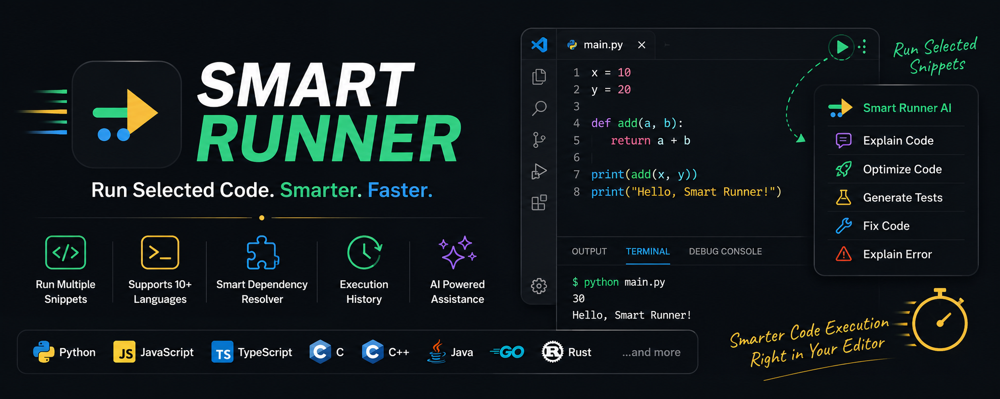

# Smart Runner



Smart Runner is a Visual Studio Code extension for running selected code snippets with locally installed interpreters and compilers. It is built for quick snippet execution, automatic same-file dependency inclusion, and AI-assisted code explanation, optimization, and error help.

## What It Does

- Runs selected code blocks from the editor.
- Supports multiple selections.
- Automatically includes obvious same-file dependencies such as variables, imports, functions, and classes.
- Warns when referenced dependencies are not found.
- Runs snippets in the integrated terminal.
- Adds visible `Run Selection` buttons above selected code and in the status bar.
- Supports Python, JavaScript, TypeScript, C, C++, Java, Go, and Rust.
- Provides optional BYO-key AI tools for explaining, fixing, optimizing, documenting, and testing code.

## Quick Start

Install dependencies:

```bash
npm install
```

Run the extension in development:

1. Open this repository in VS Code.
2. Press `F5`.
3. A new Extension Development Host window opens.
4. Open a code file in that new window.
5. Select a block of code.
6. Click `Run Selection` above the selection, or run `Smart Runner: Run Selected Snippets`.

## Running Selected Code

Smart Runner can run selected snippets from:

- CodeLens above selected code: `Run Selection`
- Status bar: `Run Selection`
- Command Palette: `Smart Runner: Run Selected Snippets`
- Keyboard shortcut: `Ctrl+Shift+R`
- Editor run dropdown: `Smart Runner: Run Selected Snippets`
- Right-click context menu: `Smart Runner: Run Selected Snippets`

Example:

```python
x = 10
y = 20

print(x + y)
```

If you select only:

```python
print(x + y)
```

Smart Runner creates a temporary runnable file that includes:

```python
x = 10

y = 20

print(x + y)
```

If a dependency cannot be found, Smart Runner warns before running.

## AI Features

Smart Runner AI uses your own provider and API key. API keys are stored with VS Code Secret Storage and are never written to project files or settings.

Supported providers:

- Gemini
- OpenAI
- Anthropic
- Groq
- OpenRouter
- Ollama
- LM Studio

Available AI actions:

- Explain selected code
- Explain algorithm
- Explain time complexity
- Explain space complexity
- Optimize code
- Generate test cases
- Generate documentation
- Refactor code
- Fix code
- Explain error

## AI Setup

Open the Command Palette and run:

```text
Smart Runner: Choose AI Provider
```

For remote providers, add your key:

```text
Smart Runner: Add or Update AI API Key
```

Test the connection:

```text
Smart Runner: Test AI Connection
```

Open the built-in AI help panel:

```text
Smart Runner AI: Help
```

## AI Editor Buttons

When code is selected, Smart Runner shows CodeLens buttons above the selection:

```text
Run Selection | Explain Selection | Fix | Explain Error | Optimize
```

The status bar also shows:

```text
Run Selection
Explain Selection
Explain Error
```

When VS Code reports diagnostics, Smart Runner also adds AI quick fixes to the lightbulb menu:

```text
Smart Runner AI: Fix Code
Smart Runner AI: Explain Error
```

## Supported Languages

| Language | Command |
| --- | --- |
| Python | `python snippet.py` |
| JavaScript | `node snippet.js` |
| TypeScript | `tsx snippet.ts` |
| C | `gcc snippet.c -o snippet && snippet` |
| C++ | `g++ snippet.cpp -o snippet && snippet` |
| Java | `javac Main.java && java -cp temp-dir Main` |
| Go | `go run snippet.go` |
| Rust | `rustc snippet.rs -o snippet && snippet` |

Smart Runner uses tools installed on your machine. It does not install compilers or interpreters.

## Development

For the full setup guide, see [SETUP.md](SETUP.md).

Compile:

```bash
npm run compile
```

Run tests:

```bash
npm test
```

Package a VSIX:

```bash
npm run package
```

Install the generated VSIX:

1. Open VS Code.
2. Run `Extensions: Install from VSIX...`.
3. Select `smart-runner-0.0.1.vsix`.
4. Reload VS Code.

## Configuration

Smart Runner settings are available under `smartRunner.*` and `smartRunner.ai.*`.

Useful settings:

- `smartRunner.pythonPath`
- `smartRunner.nodePath`
- `smartRunner.tsxPath`
- `smartRunner.cCompilerPath`
- `smartRunner.cppCompilerPath`
- `smartRunner.javaPath`
- `smartRunner.javacPath`
- `smartRunner.goPath`
- `smartRunner.rustCompilerPath`
- `smartRunner.reuseTerminal`
- `smartRunner.ai.provider`
- `smartRunner.ai.model`
- `smartRunner.ai.baseUrl`
- `smartRunner.ai.selectionCodeLens`

## Troubleshooting

If CodeLens buttons do not appear:

```json
"editor.codeLens": true,
"smartRunner.ai.selectionCodeLens": true
```

If TypeScript snippets fail, install or configure `tsx`.

If Java snippets fail, make sure the selected code fits the `Main.java` entry-point model.

If AI commands fail, run:

```text
Smart Runner: Test AI Connection
```

If a selected snippet fails because of a missing name, check the warning shown by Smart Runner. The dependency resolver uses same-file heuristics and is not a full AST engine yet.

## Security

- API keys are stored only in VS Code Secret Storage.
- API keys are never written to `settings.json`, `package.json`, temporary files, or project files.
- API keys are sent only to the selected provider.
- Error messages are redacted before being shown.
- Local providers can be used with no API key.

## Roadmap

- AST-backed dependency resolution.
- Captured execution mode for automatic terminal-error explanation.
- Debugger integration.
- Rich execution diagnostics.
- Shareable snippets and synchronized history.
